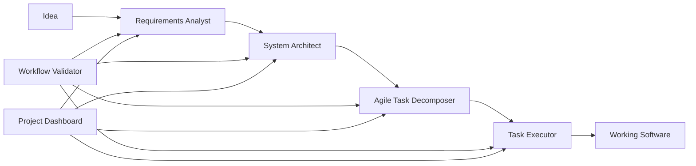

# Spec-Driven Development Agent System

A comprehensive multi-agent system that orchestrates the complete software development workflow from idea to implementation.

## Overview

This agent system implements a spec-driven development methodology through four core agents that work together:

1. **Requirements Analyst** - Transforms ideas into user stories
2. **System Architect** - Creates technical designs from requirements
3. **Agile Task Decomposer** - Breaks designs into actionable tasks
4. **Task Executor** - Implements tasks with professional standards

## Agent Communication Flow



## Core Agents

### 🎯 Requirements Analyst (`requirements-analyst`)
- Gathers and clarifies user needs
- Creates numbered user stories with Gherkin acceptance criteria
- Outputs: `docs/[feature]/requirements.md`

### 🏗️ System Architect (`system-architect`)
- Analyzes requirements and creates technical designs
- Produces architecture diagrams and interface contracts
- Outputs: `docs/[feature]/design.md`

### 📋 Agile Task Decomposer (`agile-task-decomposer`)
- Breaks down designs into INVEST-compliant tasks
- Prioritizes continuous value delivery
- Outputs: `docs/[feature]/tasks.md`

### 🔨 Task Executor (`task-executor`)
- Implements individual tasks following TDD
- Validates against requirements and design
- Updates task completion status

## Orchestration Agents

### 🎭 Spec-Driven Development Orchestrator (`spec-driven-development`)
The main orchestrator that coordinates the entire workflow:
- Manages handoffs between agents
- Ensures quality gates at each stage
- Provides workflow flexibility

### 🚀 Development Accelerator (`dev-accelerator`)
Provides intelligent shortcuts through the workflow:
- Auto-detects current stage
- Enables rapid progression
- Supports batch operations

### 📊 Project Dashboard (`project-dashboard`)
Offers comprehensive project visibility:
- Tracks feature progress across all stages
- Identifies bottlenecks and dependencies
- Provides actionable insights

### ✅ Workflow Validator (`workflow-validator`)
Ensures quality and consistency:
- Validates artifacts at each stage
- Checks cross-stage dependencies
- Enforces project standards

## Quick Start Commands

### Full Workflow
```bash
/spec                    # Start new feature from scratch
/spec authentication     # Full workflow for auth feature
/spec payment design     # Start from design phase
```

### Rapid Development
```bash
/dev                     # Smart next action suggestion
/dev next                # Execute next incomplete task
/dev implement all api   # Batch execute API tasks
```

### Project Monitoring
```bash
/status                  # Full project overview
/status bottlenecks      # Find blocking issues
/status sprint           # Sprint planning help
```

### Quality Assurance
```bash
/validate                # Validate entire project
/validate auth           # Check specific feature
/validate fix payment    # Auto-fix issues
```

## Information Flow

### Forward Flow (Idea → Implementation)
1. **Requirements** are gathered with clear acceptance criteria
2. **Design** interprets requirements into technical architecture
3. **Tasks** decompose design into implementable units
4. **Implementation** executes tasks with validation

### Validation Flow
- Each stage validates inputs from previous stage
- Cross-stage traceability ensures alignment
- Quality gates prevent issue propagation

### Feedback Flow
- Implementation results inform requirement updates
- Design adjustments based on implementation feasibility
- Task refinement based on actual effort

## Agent Communication Patterns

### 1. Sequential Handoff
```
Requirements Analyst → System Architect → Task Decomposer → Task Executor
```
Each agent completes its work and passes context to the next.

### 2. Validation Checkpoint
```
Any Agent → Workflow Validator → Continue/Fix
```
Validator ensures quality before progression.

### 3. Status Query
```
Project Dashboard → All Agents → Aggregated Status
```
Dashboard queries all stages for comprehensive view.

### 4. Smart Navigation
```
Dev Accelerator → Detect Stage → Invoke Appropriate Agent
```
Accelerator determines context and routes accordingly.

## File Structure

```
project/
├── agents/                         # Agent definitions
│   ├── requirements-analyst.md
│   ├── system-architect.md
│   ├── agile-task-decomposer.md
│   ├── task-executor.md
│   ├── spec-driven-development.md
│   ├── dev-accelerator.md
│   ├── project-dashboard.md
│   └── workflow-validator.md
├── .claude/
│   └── commands/                   # Slash commands
│       ├── spec.md
│       ├── dev.md
│       ├── status.md
│       ├── validate.md
│       └── spec/                   # Sub-commands
│           ├── requirements.md
│           ├── design.md
│           ├── tasks.md
│           └── implement.md
└── docs/                          # Feature specifications
    └── [feature-name]/
        ├── requirements.md        # User stories
        ├── design.md             # Technical design
        ├── tasks.md              # Implementation tasks
        └── traceability.md       # Requirement mapping
```

## Best Practices

### 1. Start with Clear Requirements
Always begin with the requirements analyst to ensure clear understanding of user needs.

### 2. Validate Early and Often
Use the workflow validator at each stage to catch issues early.

### 3. Maintain Traceability
Ensure each task references requirements and each design element addresses user stories.

### 4. Focus on Value Delivery
Tasks should deliver visible value, not just technical changes.

### 5. Use Appropriate Entry Points
- New features: Start with `/spec`
- Existing features: Use `/dev` for smart navigation
- Quick tasks: Jump directly with `/spec/implement`

## Example Workflows

### New Feature Development
```bash
# 1. Gather requirements
/spec authentication

# 2. System automatically proceeds through:
# - Technical design creation
# - Task decomposition
# - Implementation guidance
```

### Resuming Work
```bash
# Check project status
/status

# Continue where you left off
/dev next
```

### Feature Analysis
```bash
# Deep dive into a feature
/status shopping-cart

# Validate before implementation
/validate shopping-cart
```

### Sprint Planning
```bash
# Get sprint recommendations
/status sprint

# Execute sprint tasks
/dev implement all sprint
```

## Customization

Each agent can be customized by modifying its markdown file:
- Adjust system prompts for different methodologies
- Add project-specific validation rules
- Customize output formats
- Define workflow variations

## Integration

The system integrates with:
- Version control (git)
- CI/CD pipelines
- Project management tools
- Testing frameworks
- Documentation systems

## Troubleshooting

### Common Issues

1. **Missing Dependencies**
   - Run `/validate dependencies` to identify issues
   - Fix with `/validate fix [feature]`

2. **Stalled Features**
   - Check with `/status bottlenecks`
   - Resume with `/dev [feature]`

3. **Quality Issues**
   - Validate with `/validate [feature]`
   - Fix automatically where possible

### Getting Help

- View agent details: `@agents/[agent-name].md`
- Check slash commands: `/help`
- Review this documentation: `@agents/README.md`
