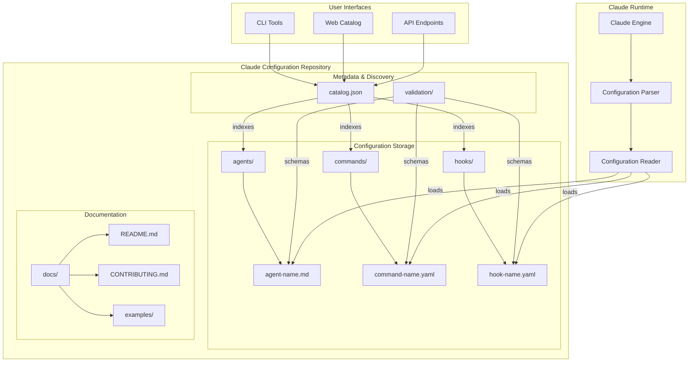
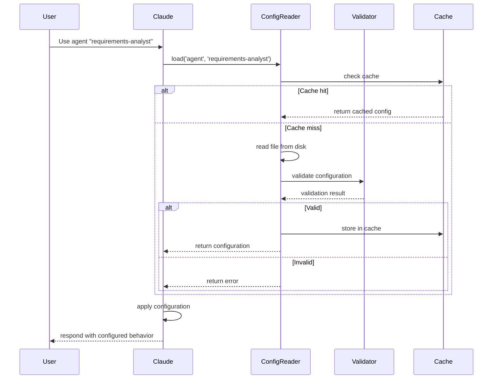

# Claude Configuration Repository - Technical Design Document

## Feature Overview

The Claude Configuration Repository provides a centralized, version-controlled system for managing reusable Claude AI configurations. This design enables developers to share and discover pre-built agents, commands, and hooks that enhance productivity and standardize AI-powered workflows. The key user value includes:

- **Discoverability**: Easy browsing and searching of available AI configurations
- **Reusability**: Share proven configurations across teams and projects
- **Consistency**: Standardized format for defining AI behaviors
- **Extensibility**: Simple process for adding new configuration types
- **Version Control**: Track changes and enable stable configuration references

## Architecture Overview



## File Structure

```
ccconfig/
├── agents/                      # Agent configurations
│   ├── README.md               # Agent creation guide
│   ├── template.md             # Agent template file
│   └── *.md                    # Individual agent files
├── commands/                    # Command configurations
│   ├── README.md               # Command creation guide
│   ├── template.yaml           # Command template
│   └── *.yaml                  # Individual command files
├── hooks/                       # Hook configurations
│   ├── README.md               # Hook creation guide
│   ├── template.yaml           # Hook template
│   └── *.yaml                  # Individual hook files
├── validation/                  # Schema validation
│   ├── agent.schema.json       # Agent configuration schema
│   ├── command.schema.json     # Command configuration schema
│   └── hook.schema.json        # Hook configuration schema
├── scripts/                     # Utility scripts
│   ├── validate.js             # Configuration validator
│   ├── generate-catalog.js     # Catalog generator
│   └── test-config.js          # Configuration tester
├── docs/                        # Documentation
│   ├── getting-started.md      # Quick start guide
│   ├── architecture.md         # This document
│   └── examples/               # Usage examples
├── catalog.json                 # Generated configuration index
├── README.md                    # Repository overview
├── CONTRIBUTING.md              # Contribution guidelines
└── .github/                     # GitHub-specific files
    └── workflows/
        ├── validate.yml         # Validation workflow
        └── catalog.yml          # Catalog generation workflow
```

## Component Specifications

### 1. Agent Configuration Format

**File**: `agents/*.md`

```markdown
---
name: agent-identifier          # Unique identifier (kebab-case)
description: Brief description  # One-line summary
version: 1.0.0                 # Semantic version
author: GitHub username        # Creator attribution
tags: [tag1, tag2]            # Searchable tags
color: purple                 # UI color (optional)
---

# Agent Name

## Overview
Detailed description of the agent's purpose and capabilities.

## Use Cases
- Example use case 1
- Example use case 2

## System Prompt
The complete system prompt that defines the agent's behavior...

## Examples
### Example 1
**Context**: Description
**User**: Input
**Assistant**: Expected response

## Configuration
Any agent-specific configuration options...
```

### 2. Command Configuration Format

**File**: `commands/*.yaml`

```yaml
# Command metadata
name: command-identifier
description: Brief description of the command
version: 1.0.0
author: GitHub username
tags: [productivity, automation]

# Command specification
command:
  # The actual command pattern
  pattern: "/command-name {arg1} {arg2?}"
  
  # Parameter definitions
  parameters:
    arg1:
      type: string
      description: First argument description
      required: true
    arg2:
      type: string
      description: Optional second argument
      required: false
      default: "default-value"
  
  # Command behavior
  action:
    type: prompt  # or 'function', 'workflow'
    prompt: |
      Based on the parameters:
      - arg1: {{arg1}}
      - arg2: {{arg2}}
      
      Execute the following...
    
  # Optional response template
  response:
    format: markdown
    template: |
      ## Command Result
      {{output}}

# Usage examples
examples:
  - input: "/command-name value1"
    description: Basic usage example
  - input: "/command-name value1 value2"
    description: Usage with optional parameter
```

### 3. Hook Configuration Format

**File**: `hooks/*.yaml`

```yaml
# Hook metadata
name: hook-identifier
description: Brief description of the hook
version: 1.0.0
author: GitHub username
tags: [automation, workflow]

# Hook specification
hook:
  # Trigger configuration
  trigger:
    event: on_message_start  # or on_message_end, on_error, etc.
    condition: |
      # Optional condition (JavaScript expression)
      message.content.includes('specific-text')
  
  # Hook action
  action:
    type: modify_prompt  # or 'add_context', 'log', 'notify'
    config:
      prepend: |
        Remember to consider these points:
        - Point 1
        - Point 2
      
  # Hook settings
  settings:
    enabled: true
    priority: 100  # Higher priority runs first
    async: false   # Whether to run asynchronously

# Usage examples
examples:
  - scenario: "User asks about testing"
    behavior: "Adds testing best practices context"
```

### 4. Catalog Index Format

**File**: `catalog.json` (auto-generated)

```json
{
  "version": "1.0.0",
  "generated": "2024-01-25T10:00:00Z",
  "agents": [
    {
      "name": "requirements-analyst",
      "description": "Transforms ideas into User Stories",
      "version": "1.0.0",
      "author": "username",
      "tags": ["requirements", "agile"],
      "path": "agents/requirements-analyst.md",
      "size": 2048,
      "lastModified": "2024-01-20T10:00:00Z"
    }
  ],
  "commands": [
    {
      "name": "generate-tests",
      "description": "Generates test cases from requirements",
      "version": "1.0.0",
      "author": "username",
      "tags": ["testing", "automation"],
      "path": "commands/generate-tests.yaml"
    }
  ],
  "hooks": [
    {
      "name": "security-reminder",
      "description": "Adds security context for sensitive operations",
      "version": "1.0.0",
      "author": "username",
      "tags": ["security", "best-practices"],
      "path": "hooks/security-reminder.yaml"
    }
  ],
  "stats": {
    "totalAgents": 4,
    "totalCommands": 10,
    "totalHooks": 5,
    "contributors": 12
  }
}
```

## Interface Contracts

### 1. Configuration Reader Interface

```typescript
interface ConfigurationReader {
  // Load a specific configuration by type and name
  load(type: ConfigType, name: string): Promise<Configuration>;
  
  // List all configurations of a specific type
  list(type: ConfigType): Promise<ConfigurationMetadata[]>;
  
  // Search configurations by query
  search(query: string, filters?: SearchFilters): Promise<SearchResult[]>;
  
  // Validate a configuration file
  validate(type: ConfigType, content: string): ValidationResult;
}

enum ConfigType {
  AGENT = 'agent',
  COMMAND = 'command',
  HOOK = 'hook'
}

interface Configuration {
  type: ConfigType;
  name: string;
  content: string;
  metadata: ConfigurationMetadata;
}

interface ConfigurationMetadata {
  name: string;
  description: string;
  version: string;
  author: string;
  tags: string[];
  path: string;
}
```

### 2. Validation Service Interface

```typescript
interface ValidationService {
  // Validate configuration against schema
  validateSchema(type: ConfigType, content: object): SchemaValidationResult;
  
  // Validate configuration logic and consistency
  validateLogic(config: Configuration): LogicValidationResult;
  
  // Run integration tests for configuration
  testConfiguration(config: Configuration): TestResult;
}

interface SchemaValidationResult {
  valid: boolean;
  errors: ValidationError[];
}

interface ValidationError {
  path: string;
  message: string;
  severity: 'error' | 'warning';
}
```

### 3. Catalog Service Interface

```typescript
interface CatalogService {
  // Generate catalog from repository
  generateCatalog(): Promise<Catalog>;
  
  // Update catalog incrementally
  updateCatalog(changes: FileChange[]): Promise<Catalog>;
  
  // Query catalog with filters
  queryCatalog(filters: CatalogFilters): Promise<CatalogEntry[]>;
}

interface Catalog {
  version: string;
  generated: Date;
  agents: CatalogEntry[];
  commands: CatalogEntry[];
  hooks: CatalogEntry[];
  stats: CatalogStats;
}

interface CatalogEntry {
  name: string;
  description: string;
  version: string;
  author: string;
  tags: string[];
  path: string;
  size?: number;
  lastModified?: Date;
}
```

## Technical Implementation Details

### 1. Configuration Loading Process



### 2. Validation Pipeline

```javascript
// Example validation implementation
class ConfigurationValidator {
  constructor(schemas) {
    this.schemas = schemas;
    this.ajv = new Ajv({ allErrors: true });
  }
  
  async validate(type, content) {
    // Step 1: Parse frontmatter
    const { metadata, body } = this.parseFrontmatter(content);
    
    // Step 2: Schema validation
    const schema = this.schemas[type];
    const valid = this.ajv.validate(schema, metadata);
    
    if (!valid) {
      return {
        valid: false,
        errors: this.ajv.errors.map(e => ({
          path: e.instancePath,
          message: e.message,
          severity: 'error'
        }))
      };
    }
    
    // Step 3: Content validation
    const contentErrors = await this.validateContent(type, body);
    
    return {
      valid: contentErrors.length === 0,
      errors: contentErrors
    };
  }
  
  // TODO: Implement content-specific validation
  async validateContent(type, content) {
    // Validate based on configuration type
    switch(type) {
      case 'agent':
        return this.validateAgentContent(content);
      case 'command':
        return this.validateCommandContent(content);
      case 'hook':
        return this.validateHookContent(content);
    }
  }
}
```

### 3. Catalog Generation

```javascript
// Example catalog generation script
class CatalogGenerator {
  async generate(rootDir) {
    const catalog = {
      version: "1.0.0",
      generated: new Date().toISOString(),
      agents: [],
      commands: [],
      hooks: [],
      stats: {}
    };
    
    // Process each configuration type
    catalog.agents = await this.processDirectory(
      path.join(rootDir, 'agents'),
      'agent'
    );
    
    catalog.commands = await this.processDirectory(
      path.join(rootDir, 'commands'),
      'command'
    );
    
    catalog.hooks = await this.processDirectory(
      path.join(rootDir, 'hooks'),
      'hook'
    );
    
    // Calculate statistics
    catalog.stats = {
      totalAgents: catalog.agents.length,
      totalCommands: catalog.commands.length,
      totalHooks: catalog.hooks.length,
      contributors: await this.getContributorCount()
    };
    
    return catalog;
  }
  
  // TODO: Implement directory processing
  async processDirectory(dir, type) {
    // Read all files in directory
    // Parse metadata
    // Validate configurations
    // Return catalog entries
  }
}
```

## Testing Strategy

### 1. Unit Tests

- **Configuration Parser Tests**: Validate frontmatter parsing and content extraction
- **Schema Validation Tests**: Ensure schemas correctly validate configurations
- **Catalog Generation Tests**: Verify catalog accuracy and completeness

### 2. Integration Tests

- **Configuration Loading Tests**: Test end-to-end configuration loading
- **Multi-Configuration Tests**: Verify interactions between agents, commands, and hooks
- **Version Compatibility Tests**: Ensure backward compatibility

### 3. Acceptance Tests

Based on the acceptance criteria from requirements:

```gherkin
Feature: Agent Management
  Scenario: Browse available agents
    Given the claude-config repository is cloned
    When I navigate to the agents directory
    Then I should see all agent markdown files
    And each agent should have required metadata fields
    
  Scenario: Use agent from repository
    Given I have the repository with agent "requirements-analyst"
    When I reference the agent in Claude
    Then Claude should load the agent configuration
    And apply the defined system prompt
```

### 4. Performance Tests

- **Catalog Query Performance**: Ensure fast searches in large catalogs
- **Configuration Loading Speed**: Verify quick configuration access
- **Cache Effectiveness**: Measure cache hit rates and memory usage

## Deployment Considerations

### 1. Repository Setup

```bash
# Initial repository structure
mkdir -p ccconfig/{agents,commands,hooks,validation,scripts,docs}

# Add templates
cp templates/agent.template.md agents/template.md
cp templates/command.template.yaml commands/template.yaml
cp templates/hook.template.yaml hooks/template.yaml

# Initialize validation schemas
cp schemas/*.json validation/

# Setup GitHub Actions
cp .github/workflows/* .github/workflows/
```

### 2. CI/CD Pipeline

```yaml
# .github/workflows/validate.yml
name: Validate Configurations
on:
  pull_request:
    paths:
      - 'agents/**'
      - 'commands/**'
      - 'hooks/**'

jobs:
  validate:
    runs-on: ubuntu-latest
    steps:
      - uses: actions/checkout@v3
      - uses: actions/setup-node@v3
      - run: npm install
      - run: npm run validate
      - run: npm run test
```

### 3. Distribution Methods

1. **Git Repository**: Primary distribution via Git clone/pull
2. **NPM Package**: Optional npm package for programmatic access
3. **Web Catalog**: Static site generation for browsing
4. **API Service**: Optional REST API for configuration queries

### 4. Versioning Strategy

- **Repository Tags**: Use Git tags for stable releases (v1.0.0)
- **Configuration Versions**: Individual configs use semantic versioning
- **Breaking Changes**: Document in CHANGELOG.md with migration guides
- **Compatibility Matrix**: Maintain Claude version compatibility table

## Security Considerations

1. **Input Validation**: All configurations must be validated before use
2. **Sandboxing**: Commands and hooks run in restricted environments
3. **Code Review**: All contributions require peer review
4. **Dependency Scanning**: Regular security audits of dependencies
5. **Access Control**: Repository permissions for maintainers

## Future Enhancements

1. **Configuration Composition**: Allow configurations to extend others
2. **Dynamic Loading**: Hot-reload configurations without restart
3. **Analytics**: Track popular configurations and usage patterns
4. **Marketplace**: Web interface for discovering and rating configs
5. **IDE Integration**: Plugins for VS Code, JetBrains, etc.
6. **Configuration Testing**: Interactive playground for testing
7. **Multi-language Support**: Configurations in multiple languages
8. **Configuration Dependencies**: Define dependencies between configs

## Summary

This design provides a scalable, maintainable architecture for the Claude Configuration Repository. Key design decisions include:

- **File-based storage** with version control for transparency
- **Standardized formats** with schema validation for consistency
- **Generated catalog** for efficient discovery and search
- **Modular structure** supporting independent configuration types
- **Extensible design** allowing new configuration types
- **CI/CD automation** ensuring quality and consistency

The architecture balances simplicity for contributors with robustness for users, enabling a thriving ecosystem of reusable Claude AI configurations.